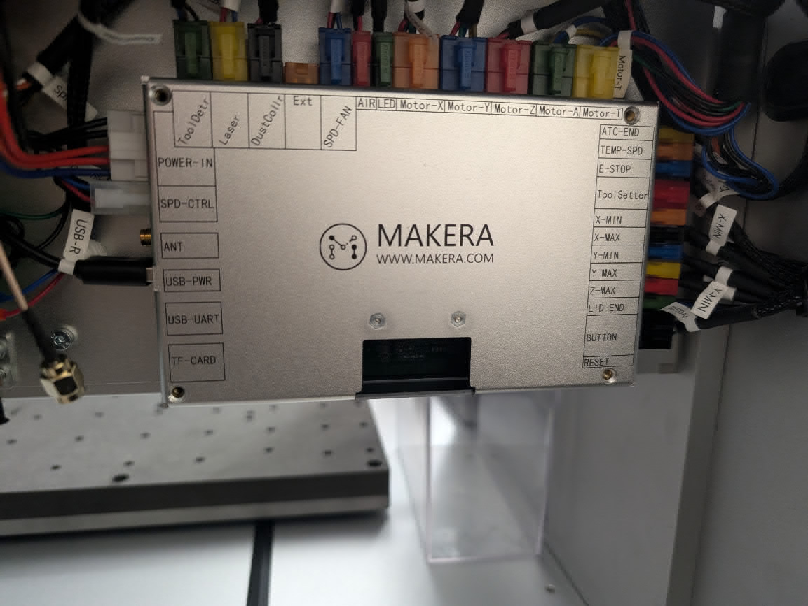
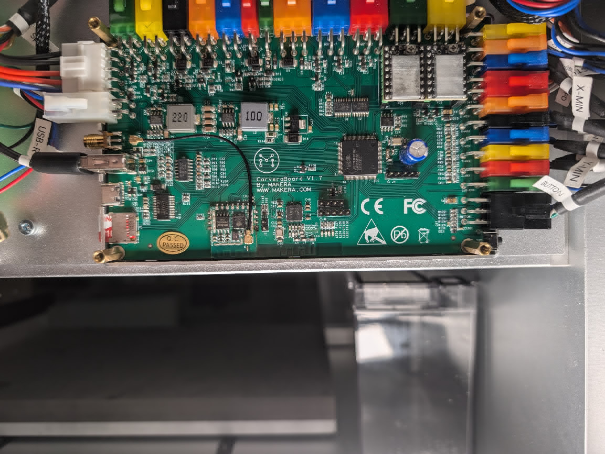

# Carvera

The [Carvera](https://www.makera.com/products/carvera) is a desktop CNC milling machine machine sold by Makera. 

## Board

The main control board can be found behind the back panel of the machine. The board is enclosed in the below box:



Under the cover is the main PCB that looks like below:



Technical details of the board:

- Main Processor: LPC1768FBD100
- Co-processors
    - ESP M8266 module for WiFI
    - CC2530 module (currently unused?)
- Micro SD card slot (labeld `TF Card`) wired directly to the main processor
- USB-C female poart (labeled `USB-UART`)
    - Normally routed to the machine back panel USB-C port
    - On the board, linked to an FTDI 232RL USB-to-Serial IC and then to the main processor
    - FTDI chip supports up to a 3MHz baud rate. (divides a 48Mhz reference clock)  
- X,Y,Z axes
    - Main processor connected to external motor drivers via 2 x 74HCT245 logic transceiver ICs
- A,T axes
    - 2 x TMC2209 stepper motor drivers onboard.

## Firmware

The main processor runs Smoothieware with custom patches. Source code is [here](https://github.com/brooklikeme/Smoothieware/tree/makera). Smoothieware documentation can be found [here](https://smoothieware.github.io/Webif-pack/documentation/web/html/index.html).

TODO: Maintain a fork repository.

### Compiling

I'd recommend making the following batch to the firmware source before compiling:

```
diff --git a/src/libs/Kernel.cpp b/src/libs/Kernel.cpp
index 5b2c9072..82d85946 100644
--- a/src/libs/Kernel.cpp
+++ b/src/libs/Kernel.cpp
@@ -127,7 +127,7 @@ Kernel::Kernel()
     // default
     if(this->serial == NULL) {
         // this->serial = new(AHB0) SerialConsole(P2_8, P2_9, this->config->value(uart_checksum, baud_rate_setting_checksum)->by_default(DEFAULT_SERIAL_BAUD_RATE)->as_number());
-       this->serial = new(AHB0) SerialConsole(P2_8, P2_9, 115200);
+       this->serial = new(AHB0) SerialConsole(P2_8, P2_9, 1000000);
     }
 
     //some boards don't have leds.. TOO BAD!
```

Compiling the firmware can be done with:

```bash
# Do once
./linux_install

# Do on every compile
./BuildShell
DEFINES="-DNO_TOOLS_EXTRUDER " DEFAULT_SERIAL_BAUD_RATE=1000000 make clean all
```

Note that we pick 1MHz as a baud rate since both the LPC and FTDI chips have clocks that are even multiples of 1MHz.

Then the `LPC1768/main.bin` file can be copied to the Carvera's SDCard as `firmware.bin`.

Test the machine by sending `M114` via serial and it should show the position. Also disable WiFI by running `ap disable`.

### SD Card

The machine comes with a generic 16 GB sdcard formatted with one FAT32 partition named `CARVERA`. The root files are:

- `config.default`
- `config.txt` : Main config file for Smoothieware
- `FIRMWARE.CUR` : Current firmware flashed to the machine.
    - Firmware can be re-flashed by adding a `firmware.bin` file to the SDCard that will be renamed to this `.CUR` file name after successful flashing. 
- `gcodes/` : Directory storing gcode example files.


## Camera

TODO: Clean up this documentation

TODO: Add pictures.

Camera Mount:

- For ELP short
    - 4 x M2 14mm machine screws
- For ArduCam
    - 4 x M2 18mm machine screws
- 4 x M2 hex nuts
- 2 x M3 14mm machine screws
- For connecting the wall hinge to 1515 extrusion:
    - 2 x 5-6mm M3 screws
    - 2 x M3 hex nuts
- For connectin the extrusion to the floor bracket
    - 1 x 6mm-7mm M3 machine screw
    - 1 x M3 hex nut
- For connecting the floor bracket to the carvera
    - The stock screw is M4 x 6mm (countersunk - length measured from tip to tip)
    - Replace with a M4 x 8mm machine screw
    - Also use hot glue.


Cameras:

- https://www.amazon.com/dp/B01E8OWZM4
    - Manufacturer: ELP 
    - Sensor: AR0330
    - 2304(H) x 1536(V):
    - Pixels: 2.2 um x 2.2um

- https://www.arducam.com/product/arducam-1080p-low-light-low-distortion-usb-camera-module-with-microphone/
    - IMX323
    - Pixels: 2.8μmx 2.8μm
- https://www.arducam.com/product/arducam-fisheye-low-light-usb-camera-for-computer-2mp-1080p-imx291-wide-angle-mini-h-264-uvc-video-camera-board-with-microphone/
    - IMX291 (generally the better sensor)
    - Same as https://www.amazon.com/Arducam-Camera-Module-IMX291-Microphone/dp/B0861M62KW
    - Or https://www.amazon.com/Arducam-Camera-Computer-Microphone-Windows/dp/B07ZRJDTBQ
    - Pixel Size: 2.9 µm x 2.9 µm
    - Memory chip markings:
        - JD2336 25D20ATIG
        - Probably something like https://www.byte-semi.com/download/SPI_NOR_Flash/BY25D20AS.pdf


- Heatsink
    - 20mm x 20mm x 10mm aluminum heatsink
    - Attach with 2mm thick thermal pad


## GCode Reference

TODO: Re-verify all this information.

- `M999` : Reset from halted/alarm state.
- `$H` : Home all axes.
- `G21` : Set to millimeter mode
- `M112` : Halt
- `M114.1` : realtime position


Doing a toolchange:

```
M5 ; Stop spindle
T1 M6 ; Select tool 1 and do tool change
M3 S100 ; Start spindle at 100 RPM
```


