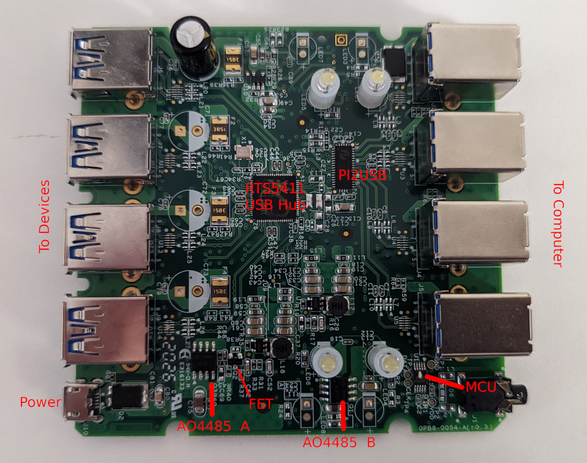
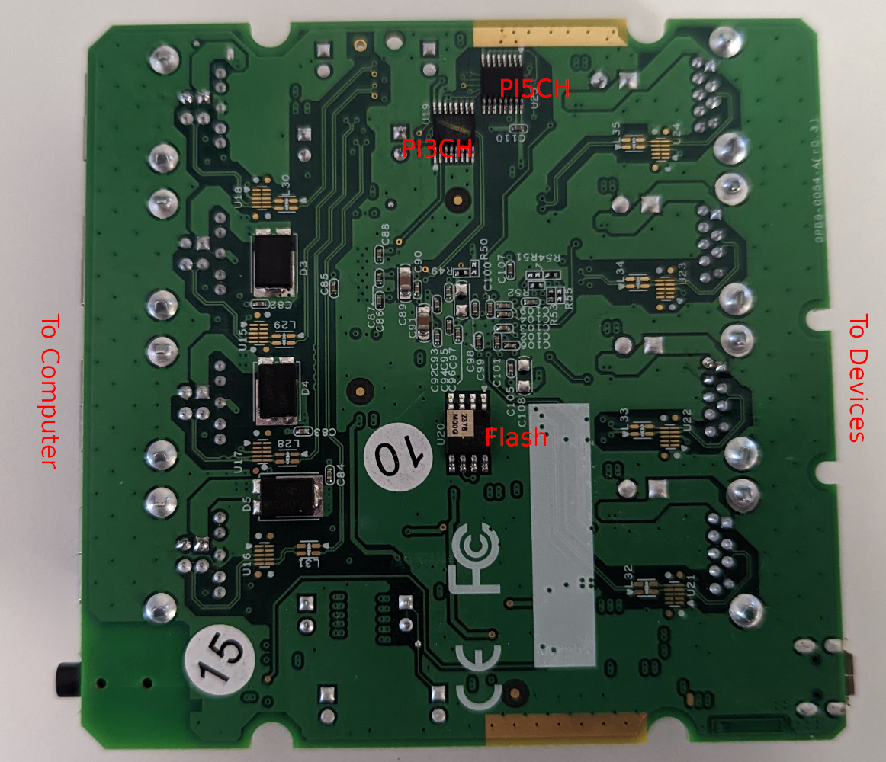
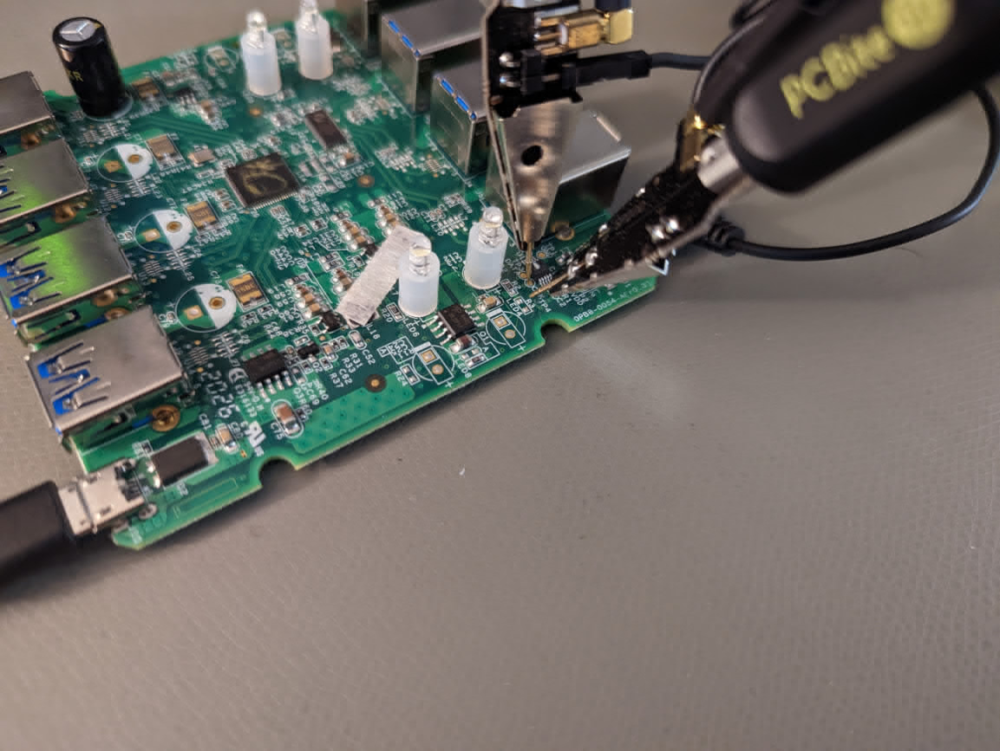
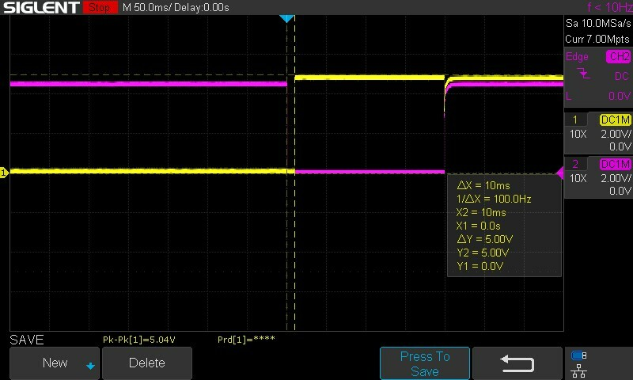
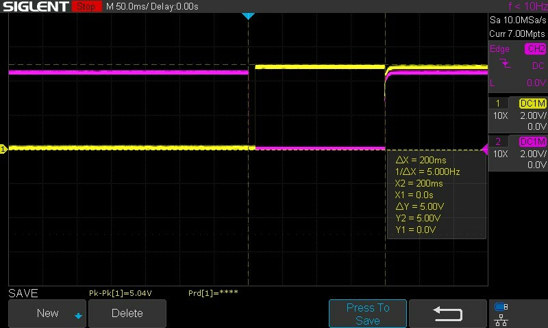
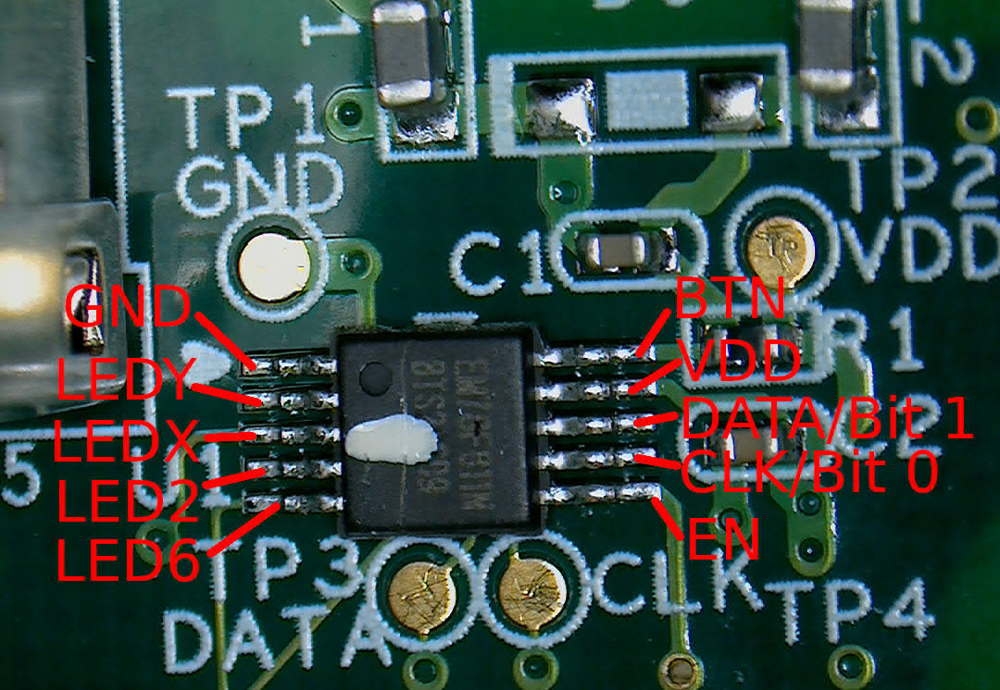

# StarTech 4-port USB3.0 Peripheral Sharing Switch

The [StarTech.com USB 3.0 Peripheral Sharing Switch](https://www.startech.com/en-us/cards-adapters/hbs304a24a) is a $110 USB switch allowing one of 4 computers to connect to a 4 port USB 3.0 (5Gbps) hub.

## Hardware Design

The switch operates as follows:

- A tactile (2-pin) button is connected via a board mounted jack which the user can press to switch which computer is actively connected to the USB device ports.
- A `EM78F811N` 8-bit MCU reads the user input and keeps track of the current state (between 0-3).
    - Exposes the 2-bit state as 2 output pins.
    - Also exposes an 'enable' pin.
- Enable pin is fed to power transistors
    - I think these simulate a connect/disconnect from the computer?
    - 2 x `AO4485`: P-Channel MOSFETs
    - The MOSFET on the left as a small SOT-23-3 FET next to it that drives the gate (this small FET is driven by the MCU 'enable' pin).
- Current state and computer USB signals fed into muxers:
    - `PI2USB3122`
        - Multiplexer IC used for switching the USB SuperSpeed TX and RX differential pairs.
    - `PI3CH281`
        - 1 differential pair to 4 outputs mux/demux
        - Most likely used the for USB 2.0 D+/D- signals?
    - `PI5C3253`
        - Low frequency general purpose mux/demux.
        - Unsure what this is used for. Probably used to mux the computer USB power into the USB Hub.
- Muxed USB signals fed into a generic 4-port USB Hub IC
    - `RTS5411`: USB Hub IC
    - `MX25L4006E`: 4Mb SPI Flash: Connected to the `RTS5411` storing config parameters.

## PCB Pictures

### Top

### Bottom

## Control Signals

For the purposes of automating the control of which input is selected, we need to determine which pins on the MCU correspond to each control signal. To figure this out, we first hooked used a multi-meter to find all the pins that trigger the LEDs to light up. Then for the remaining ones, we probed them using PCBite probes with an oscillope as follows:

Then by pressing the input switch button, we were able to see which signals changed during a transition. We found that aside from LEDs, three main pins are involved:

- 'Enable': (Channel 2 Purple in Screenshots) Goes low during a transition and then returns high once the transition is done.
- 'Bit 0': (Labeled as CLK on the PCB) : LSB of the input index.
- 'Bit 1': (Labeled as DATA on the PCB) : MSB of the input index. 

For example, with one of the bit pins on Channel 1 and 'enable' on Channel 2, we say the following transition on the oscillopscope:

The above picture shows that after the Enable pin goes low, 10ms afterwards the bit pins are flipped if needed.

Additionally we can measure that the total duration of the transition is 200ms:

After tracing all the combinations of pin levels, we came up with the following pinout for all the pins:

