# Pi Rack

This is a 2U rack mount enclosure for running up to 10 Raspberry Pi 'Model B' form factor SBCs with space for per-board 40mm fan. Additionally provided is a complementary addon board for PoE power delivery, fan control, etc.

## Enclosure

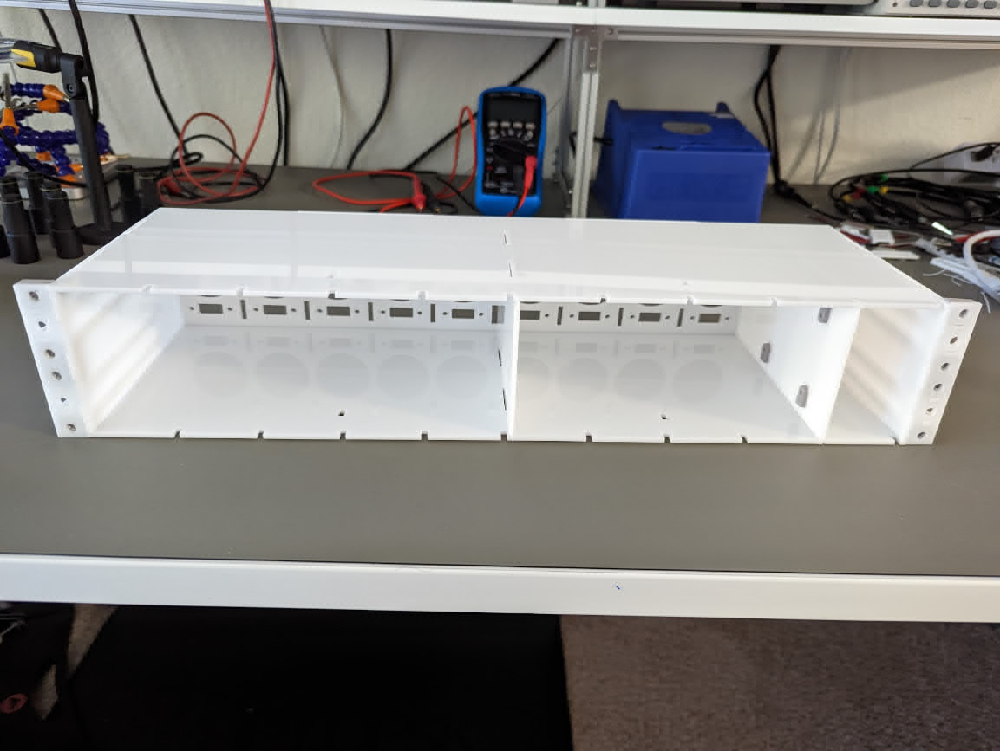

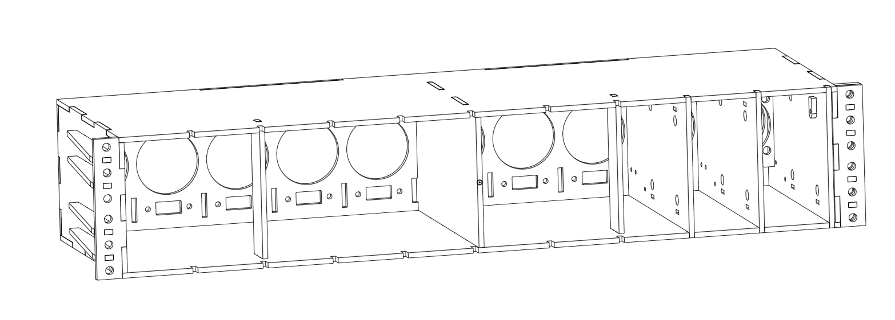

Assembly instructions:

- Laser cut pieces
- Glue together with Weld-On 4 Acrylic Adhesive
- Assemble the laser cut pieces per the arrangement shown in the above pictures (excluding the trays).
  - If attaching to the legs of an Ikea Lack table, use 4 x (M5 60mm) screws

## Tray

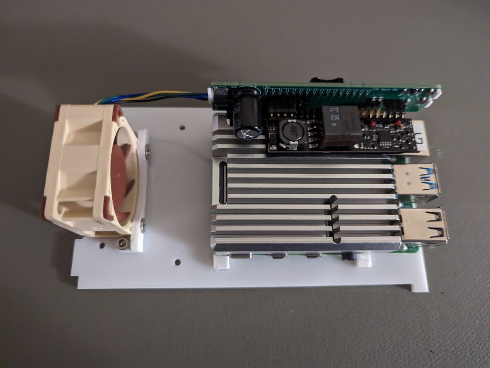

### Assembly

- Single tray
  - Laser cut 1 tray (DXF is in inch units) out of ~3mm thick acrylic.
  - Tap all small holes with an M3 tap.
  - 4 pi-mounts
    - Glue these with Gorilla glue to the tray
    - Use 4 x M2.5 8mm screws to fix the Pi to the tray
  - Print 1 fan-mount
    - Supports Noctua 40mm x 10 or 20mm fans (use the appropriate holes for either)
    - Screw on the fan with regular noctua self-tapping screws
    - Use 2 x M3 6mm screws to fix it to the tray
- 'Standard Pi 4 Armor'
  - Comes with 4 x M2.5 8mm screws 

TODO: Figure out which size of screws to use with old Pis or when not using Pi Armor.

## Board

Provided is a recommended addon board that provides must of the typical ammenities you'd want to clustering Pi's.

Features:

- PoE module connector
  - BOM: CD-HD201 diodes
  - BOM: AG5405 PoE module 
  - BOM: [SSA-112-S-T female pin headers](https://www.digikey.com/en/products/detail/samtec-inc/SSA-112-S-T/1105804)
    - These are low profile versions of regular 0.1" female headers.
  - PCB Bridge for Raspberry Pi 4 rigid connection
    - BOM: [2x2 0.1" header with 13.6mm of insulation height](https://www.digikey.com/en/products/detail/samtec-inc/ESQ-102-23-G-D/7089386)
- 2x front facing addressable RGB LEDs
  - BOM: [SK6812B-SIDE](https://www.adafruit.com/product/4691)
- RTC over I2C
  - DS3231: +/- 5ppm
  - CR1220 battery backed
  - Support for testing if the battery is dead.
- PWM Fan Connector
  - Supports PWM control and tachometer reading
  - BOM: [JST SH 4-pin connector](https://www.adafruit.com/product/4208)
- TPM over I2C
  - Infineon OPTIGA TRUST M SLS 32AIA
- Connects to a Raspberry Pi via the 40 pin connector
  - BOM: [0.1" 2x20-pin right angle female header](https://www.adafruit.com/product/2823)

## Assembly

Note: We will treat the bottom of the board as the side with the 40-pin header.

TODO: Insert pictures for each step.

**Step 1**: Solder all SMT components to the board (typically with a solder stencil, solder paste, and a reflow oven)

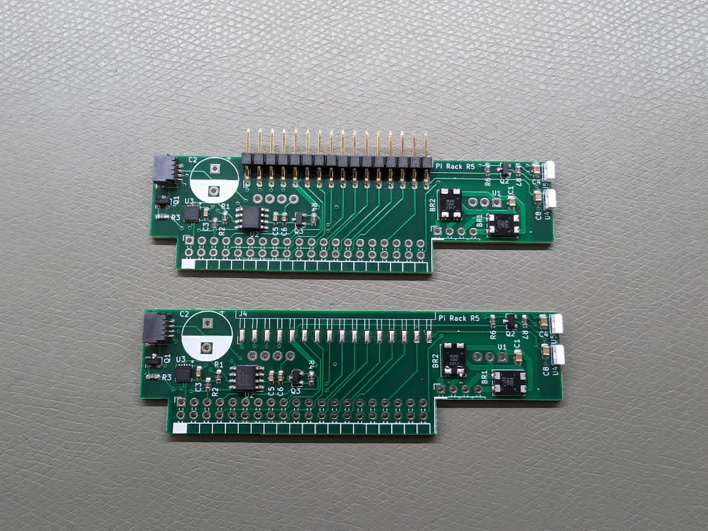

**Step 2**: Verify the solder joints under a microscope

- Note: The bottom right two pins on the TPM are allowed to touch.
- Make sure to verify there is a robust vertical connection to the PoE diodes. 

**Step 3**: Solder pin headers

- Insert the pin headers (for the PoE module and 40-pin header) into the PCB.
- Flip over and place in the 3d printed PCB holder.
- Solder all the headers by hand while in the 3d printed holder.
- Remove from the 3d printed holder.

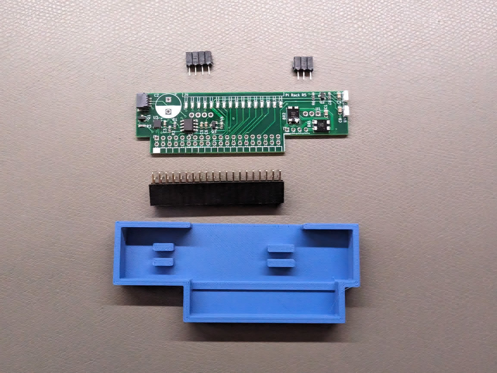

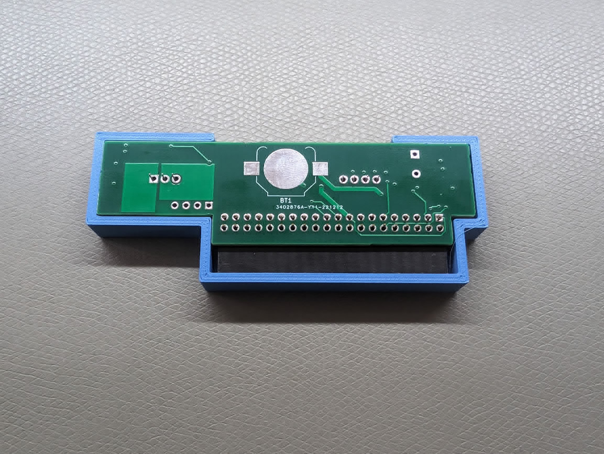

**Step 4**: Solder remaining parts

- Hand solder the electrolytic capacitor and RTC battery socket 

**Step 5**: Verify connections with multimeter

- Verify that there is no continuity between the 5V and GND pins by probing the capacitor pins with a multimeter
  - Note that if you had the PoE module in already, then you may see continuity if you flipped the polarity of your multimeter probes (which is expected).

**Step 6**: Install the PoE module

- Cover the entire back side of the AG5405 with electrical tape
- Insert the PoE module into the female headers on the board (this may require some force).
  - Note that the 3 left most pins on the right 6-pin male header of the PoE module will stay disconnected.

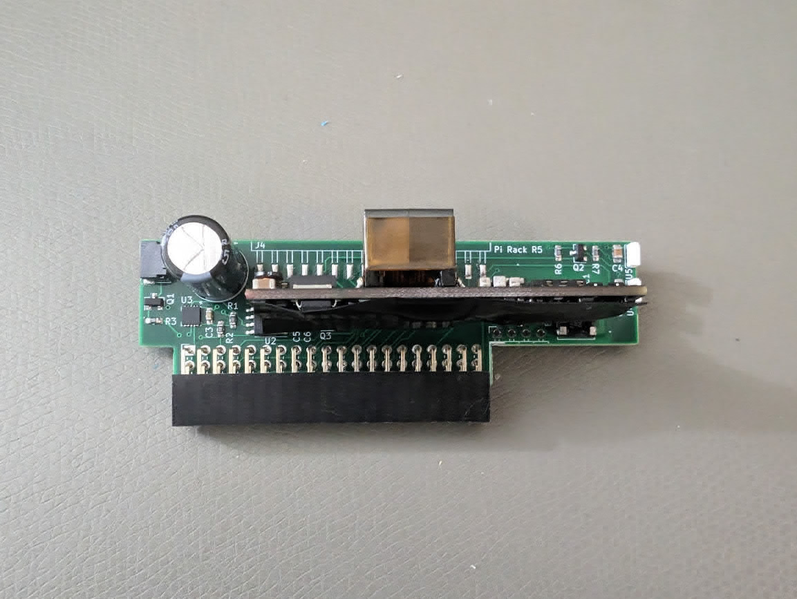

**Step 7**: Apply controlled power

In this step we will apply controlled power to the board using a bench variable power supply. If you are making many boards, it is recommended to make a breakout board for the PCB as shown below to expose pins:

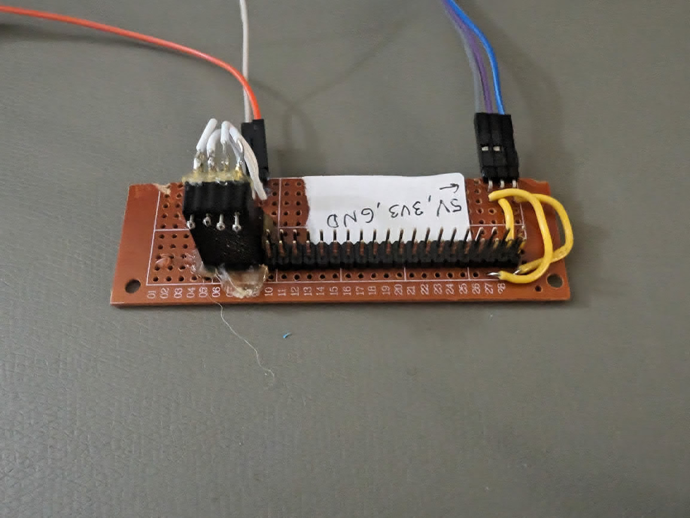

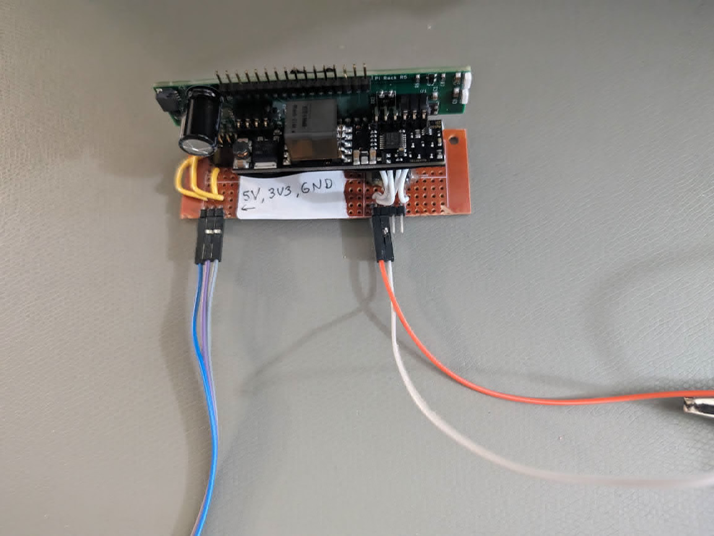

The highlights are:

- 2x20pin male header split out to 5V, 3.3V, and GND pins (see https://pinout.xyz/)
- 4 pogo pins (0.9mm stem diameter inserted into the board-pogo-bracket.stl bracket) to expose the PoE pins
  - The 4 PoE pins have meanings from left to right 'A+', 'A-', 'B+', 'B-' where the polarities can be reveresed by at least one pair of A and B pins must be present to power via PoE.

Specifically in this step you should test:

- Connect 3.3V and GND to a PSU with a current limit of ~100mA
  - Verify <5mA is flowing (may show up as zero)
- Connect one pair of PoE pins to a 48V and GND PSU with a current limit of 100mA
  - Current draw should be around 10mA
  - Verify with a multimeter that the 5V/GND pins show ~5V (can also be tested by checking the capacitor voltage)
  - Note that 48V is around the bare minimum voltage that will work. If you have smaller PSUs, you can connect them in series to add their voltages together.

**Step 8**: Add the PoE bridge

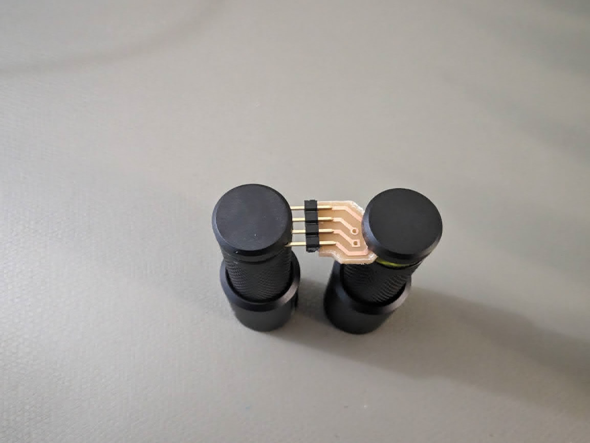

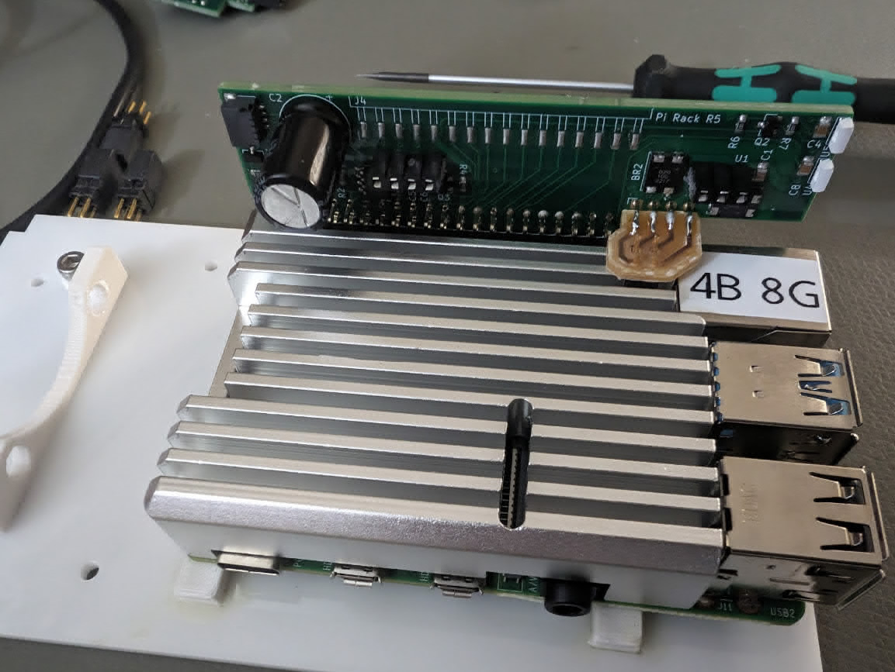

- Remove the PoE module from the board for now.
- Grab the 2x2 female pin header and verify that it fits easily into the Pi's PoE header (with any case already attached)
  - If using the full aluminum Pi Armor cases, you will need to sand down the sides of the connector to make it fit smoothly.
- For Raspberry Pi 3B+/4B
  - Mill out the poe-bridge PCB
  - Solder on a male 4-pin 0.1" header to the edge of it (ensure that that there is no continuity between any of the pins).
  - Insert the poe-bridge into the main board and fully assemble the board on top of a Raspberry Pi with heatsink and 2x2 PoE header attached.
    - The poe-bridge should be roughly flush with the main board.
  - Solder all the PoE connections (4 on the back of the board and 4 to connect the 2x2 header to the poe-bridge)
  - Trim all the pins with side cutters (note that the 2x2 header pins must not stick out by more than ~5mm to avoid hitting the PoE module)
  - Apply Gorilla glue to the entire top of the poe-bridge PCB and along the edge connecting to the main board.
    - Be sure to mask off the area around the board with masking take before doing this.
    - This step is to ensure that the copper traces don't peel off of the fiberglass whenever the poe-bridge is pulled out from the Pi.
- For Raspberry Pi 5
  - Make a custom wire connecting the 2x2 header to the board.
    - TODO: Verify if the ordering of pins is the same was used in the Pi 4
- Re-insert the PoE module

**Step 9**: Attach a fan

- Grab one of the following two fan types
  - Noctua NF-A4x20mm 5V PWM fan (prefered for continous workloads) (has 26 AWG wiring) 
  - Noctua NF-A4x10mm 5V PWM fan (has 28 AWG wiring)
- Cut off around 60mm of fan wire as measured from the square edge of the fan body
- Remove the heat shrink off of the fan wire.
- Strip ~3mm of insulation of off each of the 4 wires
- Attach a 4-pin JST SH connector
  - Looking at the side of the connector housing with tabs in it, the wiring ordering from left to right is:
    - Black, Yellow, Green, Blue
  - Don't crimp onto the insulation
  - Crimp using a 1mm wide crimping tool
  - Also use pliers to flatten the sides of the crimp before inserting into the connector housing
  - Note that the wires on the NF-A4x20mm are just barely small enough to fit in this connector so it will be a tight fit if not crimped precisely. 
- Connect the fan to the board
- Verify there is no continuity between the 5V and GND pins on the board's large capacitor by hand with a multimeter.
- Test the full board by powering it via PoE
  - Verify that the fan spins and the LEDs on the raspberry pi turn on (don't need to have an SDCard inserted).

**Step 10**: Run the self-test program

- Initial state expected
  - No RTC battery inserted
  - Fan plugged in
- The program will run through the following routine
  1. Queries the TPM with a basic ID request to verify that it is responding via I2C.
  1. Sets the fan PWM pin to low and verifies the tachometer input shows the expected RPM
  1. Switches the fan PWM between 10%, 20%, 30%, ... up to 100% and verifies the tachometer output at each step.
  1. Makes the top LED red
    - Asks the user to verify
  1. Makes the bottom LED blue
    - Asks the user to verify
  1. Makes both LEDs white
    - Asks the user to verify
  1. Turns off the RTC power and verifies that it doesn't show up in the I2C device list.
  1. Turns on the RTC power and sets the initial RTC time to 100 seconds
  1. Waits 10 seconds and verifies the RTC time has went forward
    - Then asks the user to insert an RTC battery
  1. Measures the current time on the RTC and then turns off RTC power
  1. After 10 seconds, verifies that the RTC can still respond with the right time (just on battery power)
  1. Turns back on RTC power

