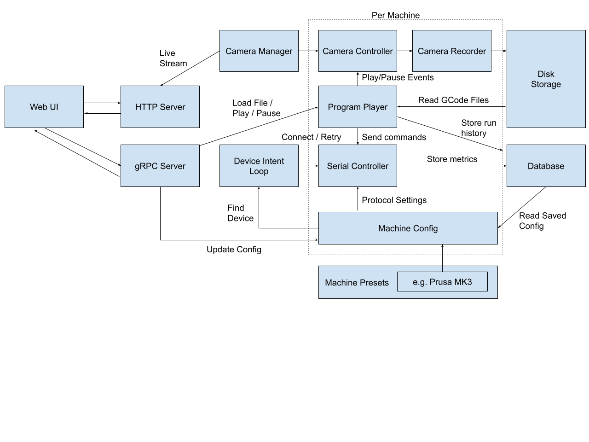

# CNC Monitoring Service

This is an application for driving a CNC / Laser Cutter / 3D Printer connected via a serial port / USB.

## Features

- Multi-machine support
- Web UI
- Support for both single/multi-tool 3d printers and milling machines.
- Optional support for cameras for live monitoring and recording.

## Architecture

The service is structured as a single binary that runs as a worker on each computer (e.g. a Raspberry Pi) attached to CNC machines. Each worker instance can connect to an arbitrary number of machines attached to the computer (assuming there is enough processing power to handle them all).

- RPC server is exposed for web or remote control. 
- Web UI is exposed by each worker for manual control of machines.

Terminology:

- A 'machine' is one controllable CNC machine.
- Each machine has a 'serial controller' which feeds commands and reads status updates to/from the machine a serial / USB port.
- 'Programs' can be uploaded which are files containing gcode commands that can be executed.
- A 'player' executes programs on machines via their serial controller.

## Getting Started

First download the latest build of the application for the specific computer architecture you want to run it on:

- [aarch64](https://storage.googleapis.com/da-manual-us/cnc-monitor/releases/cnc-monitor-2024070600-aarch64.tar) (Raspberry Pi)
- [amd64](https://storage.googleapis.com/da-manual-us/cnc-monitor/releases/cnc-monitor-2024070600-amd64.tar) (Linux personal computers)

Copy the archive downloaded above to the machine it will run on and SSH in.

Extract the files to a directory:

```
mkdir -p cnc_monitor/bundle
tar -xvf cnc-monitor-2024070600-aarch64.tar -C ./cnc_monitor/bundle
```

Maybe update the `cnc_monitor/bundle/pkg/cnc/monitor/presets/` files to include any machine settings for your brand/model of machine.

Create some directory to store all the data saved by the application:

```
mkdir -p cnc_monitor/data
```

Run the server (note that the current working directory of the application must be the directory the archive files were extracted to):

```
cd cnc_monitor/bundle

./built/pkg/cnc/monitor/cnc_monitor \
    --web_port=8000 \
    --rpc_port=8001 \
    --local_data_dir=../data
```

If you intent to run this persistently, it is recommended to add it as a systemd service that starts as boot.

Finally navigate to `http://[ip_address]:8000` in your browser to see the controls.

If your machine was defined in the presets directory, it will automatically connect once it is plugged in.

## Design

Big picture of what the code looks like:



## References

Similar products:

- Carvera Controller: https://www.youtube.com/watch?v=tQnquscGDNA
- OctoPrint: https://octoprint.org/
    - Custom reset behavior: https://plugins.octoprint.org/plugins/PrusaResetMode/
- Mainsail: https://docs.mainsail.xyz/
- CNC.js: https://cnc.js.org/
- Pronterface: https://www.pronterface.com/

Serial protocol documentation:

- Documentation for Prusa axes and commands:
    - https://help.prusa3d.com/article/prusa-firmware-specific-g-code-commands_112173
- Prusa test gcode files:
    - https://help.prusa3d.com/article/sample-g-codes_529630
    - TODO: Add unit tests for all of these.
- GRBL format described here:
    - https://github.com/gnea/grbl/blob/master/doc/markdown/interface.md
- GRBL real time API:
    - https://github.com/gnea/grbl/blob/master/doc/markdown/commands.md#ascii-realtime-command-descriptions

