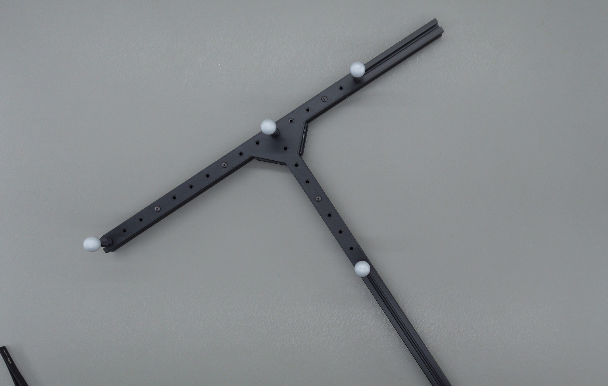
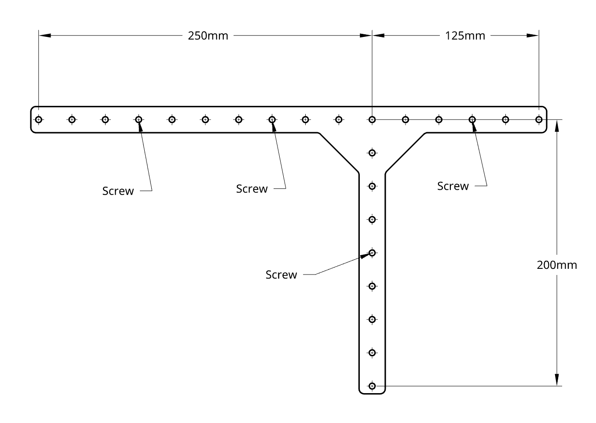

# Optical Motion Capture : Calibration Wand

This page describes how to made the T-wand that we use for calibration camera positions.

Where possible, prefer to use matte black parts to minimize calibration noise. This mainly doesn't matter for the markers and the hidden fasteners (T-nuts and threaded rods).

Besides the aluminum extrusions and right angle brackets, other parts should be safe to but on Amazon if you want to save on cost.

Parts to buy:

- 4 x M4 19mm spherical markers
- 2 x Aluminum extrusions
    - Recommend getting 400mm extrusions
    - Misumi part number: HFSB5-2020
    - These must be purchased from a well known brand to ensure dimensional accuracy.
    - Minimum lengths are:
        - 387mm for the 'head' side with 3 markers
        - 216mm for the 'handle' side with 1 marker
- 2 x Right Angle Aluminum Extrusion Brackets (+ screws/nuts)
    - Misumi Part Number: HBLFSNB5-SEU (comes with screws for the brackets)
    - Note that these use M5 screws
- 8 x M4 2020 T-Nut
    - Misumi Part Number: HNTT5-4
- 4 x M4 6mm button head screws
    - These will attach the flat plastic guide to the exstrusion
- 4 x M4 40mm threaded rod
    - This should stick out ~3-4mm out of the top of the standoff.

3D Printing

- 4 x `wand-standoff-40mm-rod.stl`
    - Example Prusa XL settings in `wand-standoff-40mm-rod.3mf`
    - Print out of ASA
    - Scale to be dimensionally accurate (usually 100.5%)
    - Random seam positioning
- 1 x `wand.stl`
    - Example Prusa XL settings in `wand.3mf`
    - Print out of PLA
    - Scale to be dimensionally accurate (usually 100.5%)
    - Drill out the holes with a 4mm drill bit if screws don't barely fit.

## Assembly

The final wand we are building should look something like the following image (though your wand will likely vary depending on the aluminum extrusion length):

With the pattern of markers and screws shown more precisely here:

The process of building this is as follows:

- Combine the 2 aluminum extrusions on a flat surface using the right angle brackets
    - Use the screw hole plate as a guide (one side of the top "T" extrusion will likely be longer than the other to fit all the screws).
- Tighten the right angle brackets while keeping the extrusions flat.
- Flip over the wand (we will only insert hardware into the side that was on the flat surface)
- Place the 3d printed holes plate over the extrusion
- Insert into the labeled holes either:
    - T-nut + wand standoff
    - or T-nut + screw
- Do this from one side of the wand to the other (tightening screws as you go and ensuring the 3d printed guide stays flat on the extrusion)
- Screw on the markers
- Flip over the wand and verify that all the markers are at the same level
    - There should be minimal wobble when the wand is standing on the tips of the markers on a flat surface.